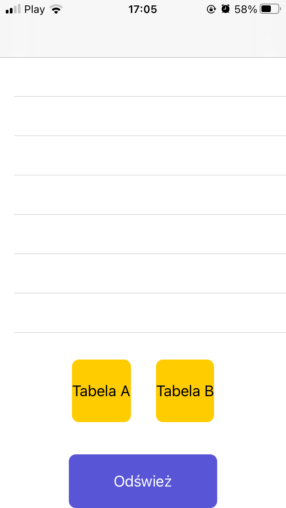
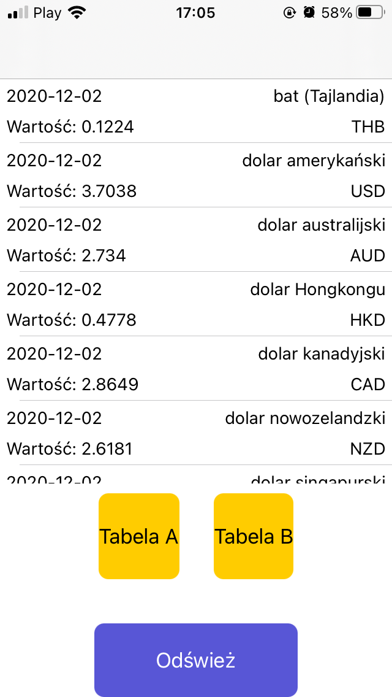
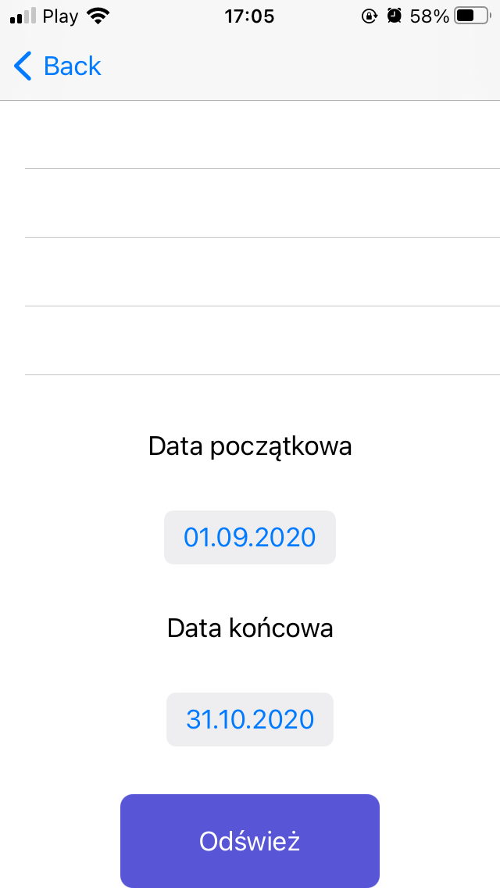

# 💸 NationalBankOfPoland-API 

The "api.nbp.pl" website provides public Web API enabling HTTP clients to query the following data sets published by the National Bank of Poland website. 

**Description:** 

**1.After button click, TableView will show you current and archived foreign exchange rates:** 
-Table A of average exchange rates of foreign currencies, 
-Table B of average foreign exchange rates, 

**2.Pressing the cell with the currency will take you to SecondVC, you can go back to FirstVC with navigation pane.** 

**3.There you can choose the the time interval from which the currency data will be loaded.** 

**4.You can refresh the data manually on both screens.** 

**5.The data loading spinner is appearing on the screen when parsingJSON.** 

**6.Cells of UITableView are customized and autolayout is set up to vertical screen.** 

    
